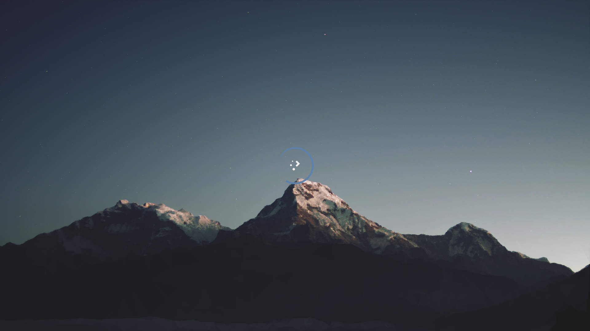

# Huzerowo KDE Plasma主题

[English version](README_en.md)

## 介绍

这个主题部分基于[Nordic KDE](https://github.com/EliverLara/Nordic/tree/master/kde)与[Utterly-Nord-Plasma](https://github.com/HimDek/Utterly-Nord-Plasma/tree/master/look-and-feel)，并附带一些个人修改。

## 截图

### 桌面

### 登录加载界面

## 说明

壁纸来自[Plasma Workspace Wallpapers / Mountain](https://invent.kde.org/plasma/plasma-workspace-wallpapers/-/tree/master/Mountain)

## 使用

### 前提

运行`kpackagetool5 --version`，如果存在`kpackagetool5`则可使用本项目主题。

### 安装

1. 克隆本项目，`git clone https://github.com/Huzerovo/kde-theme.git`
2. 进入项目文件夹`cd kde-theme`
3. 执行脚本，`./install.sh`
4. 等待脚本运行完成，若出现错误，可能是因网络原因无法安装相关依赖，
   解决问题后重新运行`./install.sh`即可。

### 卸载

1. 卸载前请确保运行过`./install.sh`，并在`desktopthemes`以及`look-and-feel`
   文件夹下有文件`package.tar.gz`存在。
2. 运行`./uninstall.sh`
3. 卸载完成后可能需要手动清理部分依赖。

