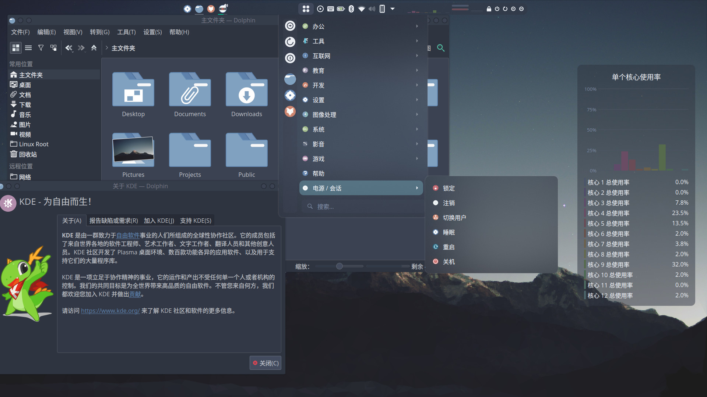
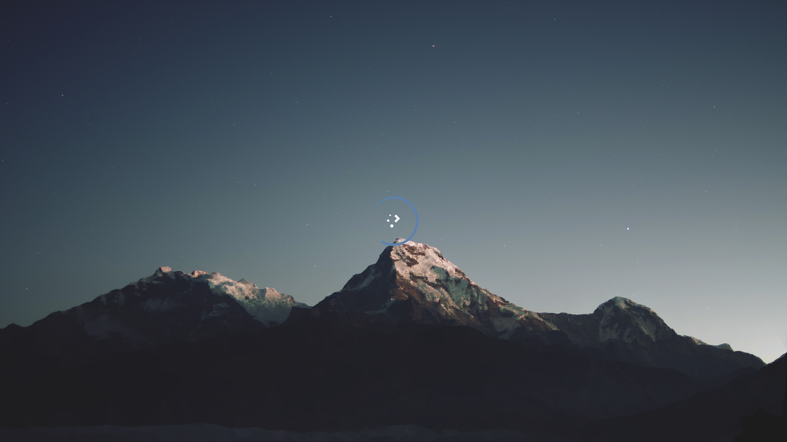

# Huzerowo KDE Plasma Theme

## Introduction

This theme is based on [Nordic KDE](https://github.com/EliverLara/Nordic/tree/master/kde) and [Utterly-Nord-Plasma](https://github.com/HimDek/Utterly-Nord-Plasma/tree/master/look-and-feel), with some modifications.

## Screenshot

### Desktop

### Splash

## Note

The wallpaper is from [Plasma Workspace Wallpapers / Mountain](https://invent.kde.org/plasma/plasma-workspace-wallpapers/-/tree/master/Mountain).

## Usage

### Prerequisite

Run `kpackagetool5 --version`, you can use this repository if you has program `kpackagetool5`.

### Install

1. Clone repository，`git clone https://github.com/Huzerovo/kde-theme.git`
2. Change direcotory to repo: `cd kde-theme`
3. Run `./install.sh`
4. Wait for it, you can rerun `./install.sh` if there are some errors.

### 卸载

1. Before uninstall, make sure you have run `./install.sh`，and there is a file named `package.tar.gz` in the folder `desktopthemes` and `look-and-feel`.
2. Run `./uninstall.sh`
3. Waiting, you may have to remove some dependences latter。

